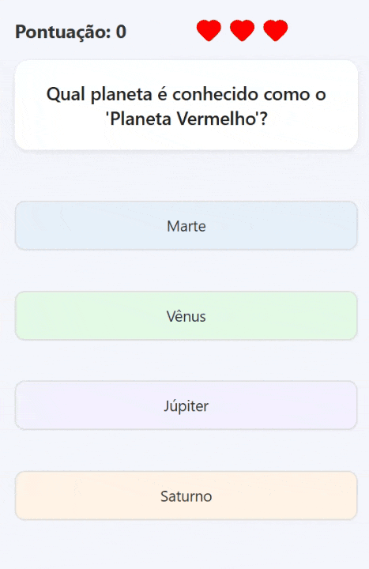
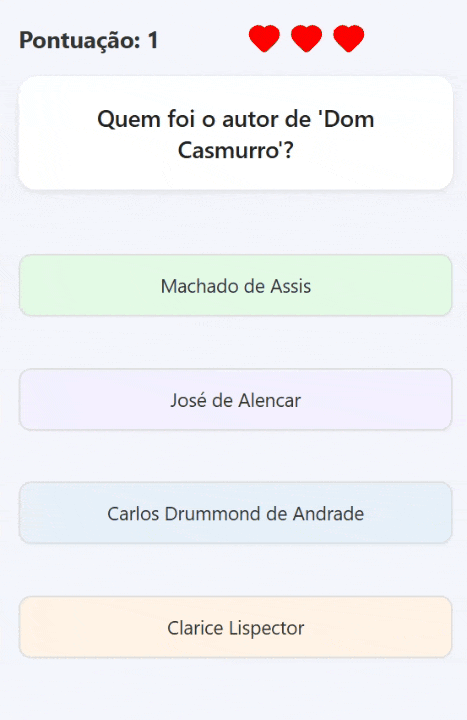

# 🏆 Quiz App - João Pedro Dias Pedroso

> Status do Projeto: Concluído ✔️

---

### Tabela de Conteúdos
* [Descrição do Projeto](#descrição-do-projeto)
* [Demonstração da Aplicação](#demonstração-da-aplicação)
* [Funcionalidades](#-funcionalidades)
* [Tecnologias Utilizadas](#️-tecnologias-utilizadas)
* [Como Rodar o Projeto Localmente](#️-como-rodar-o-projeto-localmente)
* [Funcionalidade Adicional](#-funcionalidade-adicional)
* [Autor](#-autor)

---

### Descrição do Projeto
<p align="center">
Este projeto é um aplicativo de Quiz multiplataforma, desenvolvido com React Native e Expo, como projeto final do curso de programação. O aplicativo apresenta um questionário com feedback instantâneo, tela de resultados e a possibilidade de jogar novamente.
</p>

---

### Demonstração da Aplicação
<p align="center">
  
</p>

---

### 🚀 Funcionalidades

- **Quiz Interativo:** Fluxo de perguntas e respostas com validação.
- **Feedback Visual:** Respostas são marcadas como corretas ou incorretas instantaneamente.
- **Placar:** Pontuação é calculada e atualizada a cada rodada.
- **Tela de Resultados:** Ao final do quiz, uma tela exibe a pontuação final.
- **Jogar Novamente:** O usuário pode reiniciar o quiz a partir da tela de resultados.
- **Funcionalidade Adicional:** **Sistema de vidas!** O usuario tem 3 Vidas caso erre uma questão perde uma vida, se perde as 3 o jogo reseta.

---

### 🛠️ Tecnologias Utilizadas

- **[React Native](https://reactnative.dev/)**
- **[Expo](https://expo.dev/)**
- **[TypeScript](https://www.typescriptlang.org/)**

---

### ⚙️ Como Rodar o Projeto Localmente

```bash
# 1. Clone o repositório
$ git clone https://github.com/joazao-pedroso/quiz-app.git

# 2. Navegue até o diretório do projeto
$ cd quiz-app

# 3. Instale as dependências
$ npm install

# 4. Inicie o servidor de desenvolvimento
$ npm start
```
Após executar `npm start`, pressione `w` para abrir no navegador ou escaneie o QR Code com o app Expo Go no seu celular.

---

## ✨ Funcionalidade Adicional: Sistema de Vidas!

Esta seção detalha a funcionalidade extra implementada como parte do desafio final do curso.

### Descrição
A nova funcionalidade adicionada ao aplicativo é um sistema de vidas que torna o quiz mais dinâmico e desafiador. O jogador começa com 3 vidas e, a cada resposta incorreta, perde uma delas. O jogo continua até que todas as vidas se esgotem, momento em que o usuário não pode mais prosseguir no quiz. Essa mecânica cria um senso de progressão e aumenta o fator de dificuldade, tornando a experiência mais próxima de um jogo competitivo.

### Desafios e Aprendizados
Para implementar essa funcionalidade, foi necessário pesquisar sobre controle de estado no React e entender como manipular corretamente a lógica de decremento das vidas a cada erro. O maior desafio foi garantir que o sistema de vidas se integrasse sem quebrar o fluxo principal do quiz, respeitando a lógica de respostas corretas e incorretas. Além disso, aprofundei meu uso do React Hook useState para armazenar e atualizar o número de vidas em tempo real, aplicando também conceitos de condicionais de renderização para exibir mensagens de fim de jogo quando todas as vidas são perdidas.

### Demonstração da Nova Funcionalidade
<p align="center">
  
</p>

---

### 👨‍💻 Autor

Desenvolvido por **João Pedro Dias Pedroso**.

Sob a orientação do **Prof. Rafael Ribas**.